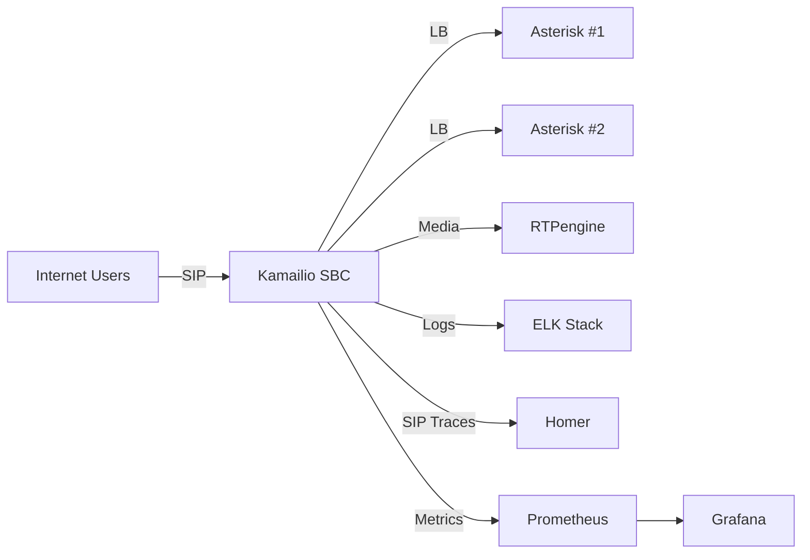

# 🧭 Kamailio SBC – Full Dockerized Architecture & Monitoring Stack

**Date:** 2025‑10‑23  
**Author:** GPT‑5  
**Version:** 1.0  

---

## 🔷 1. Initial Design Summary

**Topology Overview**
```
Internet Users → Kamailio SBC (DMZ: PublicIP 1.2.3.4)

↓

├── Asterisk #1 (192.168.10.10)

└── Asterisk #2 (192.168.10.11)

Kamailio Role: Security, Load Balancing, NAT handling
RTPengine: Media relay (SRTP, NAT Fix)
Asterisk Cluster: Call Control and Media handling
```

## 🛡️ 2. Security Layers (Multi‑Layer Defense)

|  Layer | Tool / Module	  | Description  |
|---|---|---|
| Anti‑Flood	  | pike  | Limits requests rate per IP  |
| Static Blacklist	  |permissions	   |  Blocking fixed IPs in MySQL address table |
| SIP User‑Agent Filtering	  | sanity / custom route	  | Blocks scanners like friendly‑scanner  |
|  Authentication	 |  auth, auth_db	 |Digest Auth via credential DB   |
| Custom Header Auth	  |X‑Company‑Signature	   | Additional check for official clients  |
|  Transport Security	 | TLS / mTLS	  | Optional certificate‑based authentication  |
| SRTP	  | rtpengine  | Encrypted media path  |


## 🧠 3. Client Identification Logic
Example snippet from kamailio.cfg:

cfg
```
if(!is_method(“REGISTER”)) {

  if($hdr(X-Company-Signature) != “company123KEY”) {

    sl_send_reply(“403”,“Forbidden – Invalid Signature”);

    exit;

  }

}
```
## ⚙️ 4. Load Balancing (Dispatcher)
The dispatcher module distributes SIP calls between Asterisk nodes:

1 sip:192.168.10.10:5060;weight=50

2 sip:192.168.10.11:5060;weight=50

Algorithm type: round-robin (0)

## 🔍 5. Monitoring & Telemetry Integration

|Component	|Function	|Integration
|---|---|---|
|Homer	|SIP Tracing	|via siptrace → HEP (9060/udp)|
|ELK (Filebeat + Logstash)|	Log Centralization|	/var/log/kamailio.log|
|Prometheus	|Metrics	|via xhttp_prom endpoint (port 9090)|
|Grafana|	Visualization|	Dashboard imported via Prometheus datasource|
|CDR/Dialogs|	DB logging|	acc and dialog modules|
|Registration Tracking	|exec() call|External API push for each REGISTER|

## 🐳 6. Docker Compose Overview
Network: sbc_net (10.5.0.0/24)
Sample IPs:

|Service|	IP	|Role|
|---|---|---|
|Kamailio	|10.5.0.2|	SBC core|
|RTPengine|	10.5.0.4	|Media relay|
|Homer Collector	|10.5.0.9	|SIP tracing|
|Asterisk #1	|10.5.0.10	|Call handler|
|Asterisk #2	|10.5.0.11	|Call handler|


```yaml
version: '3.8'

networks:
  sbc_net:
    ipam:
      config:
        - subnet: 10.5.0.0/24

services:

  kamailio:
    image: kamailio/kamailio:latest
    container_name: kamailio_sbc
    restart: always
    networks:
      sbc_net:
        ipv4_address: 10.5.0.2
    ports:
      - "5060:5060/udp"
      - "5060:5060/tcp"
      - "5061:5061/tls"
    volumes:
      - ./kamailio/kamailio.cfg:/etc/kamailio/kamailio.cfg
      - ./kamailio/dispatcher.list:/etc/kamailio/dispatcher.list
    environment:
      - DBURL=mysql://kamailio:pass@db/kamailio
    depends_on:
      - rtpengine

  asterisk1:
    image: andrius/asterisk:latest
    container_name: asterisk_1
    networks:
      sbc_net:
        ipv4_address: 10.5.0.10
    volumes:
      - ./asterisk/conf1:/etc/asterisk

  asterisk2:
    image: andrius/asterisk:latest
    container_name: asterisk_2
    networks:
      sbc_net:
        ipv4_address: 10.5.0.11
    volumes:
      - ./asterisk/conf2:/etc/asterisk

  rtpengine:
    image: sipwise/rtpengine:mr10.5
    container_name: rtpengine
    privileged: true
    networks:
      sbc_net:
        ipv4_address: 10.5.0.4
    command: >
      --interface=10.5.0.4
      --listen-ng=22222
      --log-level=6

  homer:
    image: sipcapture/heplify-server:latest
    container_name: homer
    networks:
      sbc_net:
        ipv4_address: 10.5.0.9
    ports:
      - "9060:9060/udp"
      - "9080:9080"
    environment:
      - HEP_SERVER_HEPLIFY=1
      - HOMER_PROMETHEUS_PORT=9096

  elk:
    image: sebp/elk:latest
    container_name: elk
    networks:
      sbc_net:
        ipv4_address: 10.5.0.8
    ports:
      - "5601:5601"
      - "9200:9200"
      - "5044:5044"
    volumes:
      - ./elk/logstash.conf:/etc/logstash/conf.d/logstash.conf

  filebeat:
    image: docker.elastic.co/beats/filebeat:7.17.0
    container_name: filebeat
    networks:
      sbc_net:
        ipv4_address: 10.5.0.6
    volumes:
      - /var/lib/docker/containers:/var/lib/docker/containers:ro
      - ./filebeat/filebeat.yml:/usr/share/filebeat/filebeat.yml

  prometheus:
    image: prom/prometheus:latest
    container_name: prometheus
    networks:
      sbc_net:
        ipv4_address: 10.5.0.12
    ports:
      - "9090:9090"
    volumes:
      - ./prometheus/prometheus.yml:/etc/prometheus/prometheus.yml

  grafana:
    image: grafana/grafana:latest
    container_name: grafana
    networks:
      sbc_net:
        ipv4_address: 10.5.0.13
    ports:
      - "3000:3000"
    depends_on:
      - prometheus

```

## 📊 8. Monitoring Dashboard Samples
Metrics exposed:

kam_sip_requests_total
kam_sip_active_dialogs
kam_reg_users_total
kam_cpu_load
Grafana panels:

Call Volume per minute
Register Success Rate
Active Dialogs per Asterisk node
## 🔒 9. Security Hardening Tips

1.Limit SSH and SIP by firewall.
2.Enable fail2ban integration using syslog.
3.Use strong DB credentials (MySQL / Postgres).
4.Enforce TLS 1.2+ in Kamailio TLS config.
5.Rotate API tokens for external telemetry consumers.

## 🧭 10. Architecture Diagram

## 🧩 11. Launch Commands
```bash
docker-compose up -d

docker ps

docker logs -f kamailio_sbc
```
# To test:

```bash
sipsak -s sip:user@1.2.3.4 -vvv
```
## 🏁 12. Final Summary
✅ Kamailio acts as a secure session border with authentication, flood prevention and logging.

✅ Dual Asterisk provides high availability and load sharing.

✅ Complete monitoring & telemetry via Homer + ELK + Grafana.

✅ Entire environment runs in Docker under an isolated network (sbc_net).


